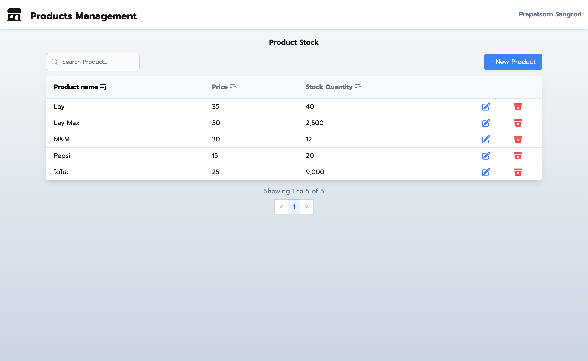
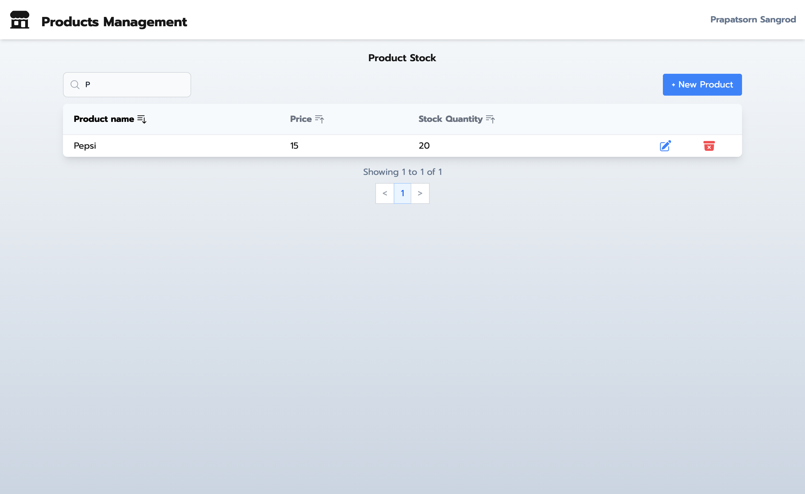
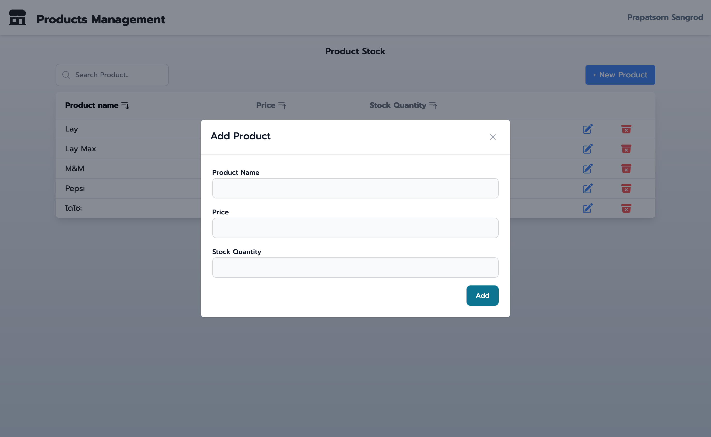
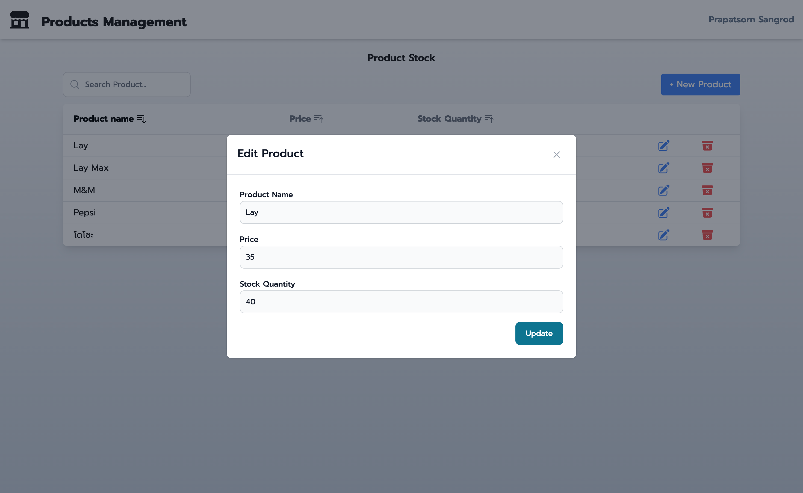
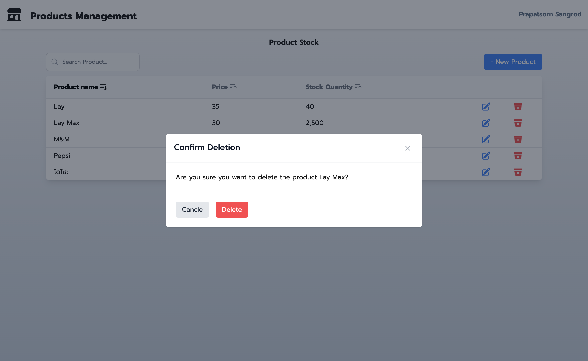

# Product Management

## Features

This website offers the following features:

1. **Product List**: Displays a list of all products with options to sort, search, add, edit, or delete products.
2. **Modals**: Includes modals for adding/editing products and confirming product deletions.

## Page Descriptions

### Product List
The Product List page displays all products in a tabular format. Users can sort the list by each column and use the search box to find specific products. It also includes options to add, edit, or delete products.




## Modals

### Add/Edit Product Modal
This modal allows users to create a new product or edit an existing product. It includes fields for product name, price, and stock quantity.




### Delete Product Confirmation Modal
This modal appears when a user attempts to delete a product. It asks for confirmation before proceeding with the deletion.



## Frontend and Backend
This section provides an overview of the frontend and backend technologies used in the project.

### Frontend
The frontend is built using React.js + tailwind Css , a Next.js framework for building server-side rendered and statically generated applications. It includes components for displaying and managing products.

### Backend
The backend is built using Node.js and Express, providing RESTful APIs for managing product data. It connects to a mySQL (Xampp) database for data storage.

## Project Setup

### Prerequisites
- Node.js
- mySQL (Xampp)

### Installation
1. Clone the repository:
    ```bash
    git clone <repository-url>
    ```
2. Install dependencies for both frontend and backend:
    ```bash
    cd frontend
    npm install
    cd ../backend
    npm install
    ```
3. Start the Mysql server.

### Running the Project
1. Start the backend server:
    ```bash
    cd backend
    npm start
    ```
2. Start the frontend server:
    ```bash
    cd frontend
    npm run dev
    ```
3. Open your browser and navigate to `http://localhost:8080` to view the application.
